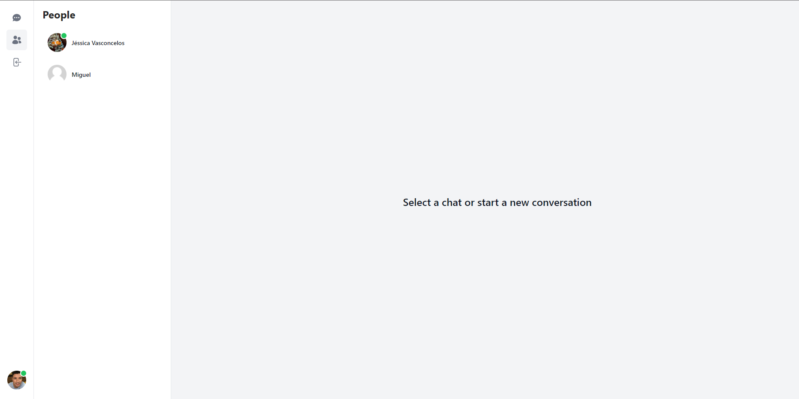
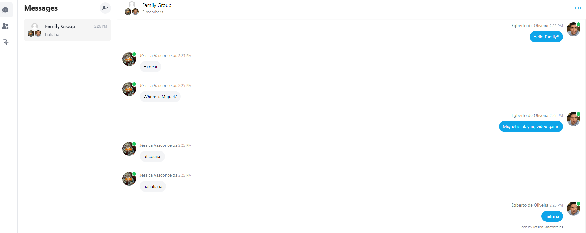

# Message Clone

### "Message Clone" is a public project developed by myself, showcasing my skills and expertise in building web applications using Next.js, Prisma, Tailwind CSS, and TypeScript. This project aims to create a messaging application similar to popular messaging platforms, providing users with real-time communication capabilities. "Message Clone" has been successfully deployed on Vercel, a leading cloud platform for static site hosting and serverless functions.

# [Site](https://messenger-clone-nextjs-4gb3.vercel.app/)
# [Video](https://messenger-clone-nextjs-4gb3.vercel.app/)

### Users Screen

 
  

### Conversation Screen

 
  

## Features and Functionality:

#### 1. User Authentication: Users can create accounts, log in securely, and manage their profile settings.
#### 2. Real-time Messaging: The application supports real-time communication between users, allowing them to send and receive messages instantly.
#### 3. Contact Management: Users can manage their contacts, add new contacts, and organize them into groups or categories.
#### 4. Message Organization: The application provides features for organizing and searching messages, ensuring efficient retrieval and management of conversations.
#### 5. Responsive Design: The application is developed with a responsive design approach, allowing it to adapt seamlessly to different screen sizes and devices.

### Technologies

##### - [NextJS](https://nextjs.org/)
##### - [Prisma](https://www.prisma.io/)
##### - [MongoDB](https://www.mongodb.com/atlas/database)
##### - [Tailwind css](https://tailwindui.com/)
